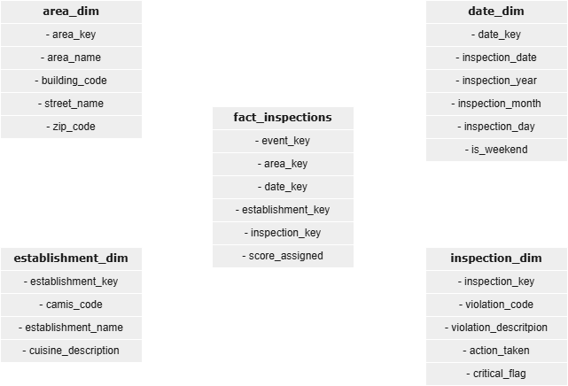

# Data Model – NYC Health Inspections

## Overview
The analytical data model is designed to support scalable and unbiased analysis
of NYC health inspections.

It follows a **star schema** optimized for:
- aggregation performance
- clear grain definition
- BI tools (Power BI, SQL analytics)

---

## Schema Type
**Star Schema**

- Central fact tables
- Conformed dimensions
- Surrogate keys
- No snowflaking

<figure style="text-align: center; margin: 1.5rem 0;">
  
  <figcaption style="margin-top: 0.5rem; font-style: italic;">
    Data model layout
  </figcaption>
</figure>

---

## Dimensions

### date_dim
**Grain:** one row per calendar date

Attributes:
- full_date
- year
- month
- month_name
- day

Purpose:
- time-based aggregation
- trend analysis

---

### area_dim
**Grain:** one row per geographic area

Attributes:
- area_name

Purpose:
- spatial comparison
- proportionality analysis

---

### establishment_dim
**Grain:** one row per establishment

Attributes:
- establishment_name
- cuisine_type
- address

Purpose:
- inspection frequency analysis
- establishment-level quality tracking

---

### violation_dim
**Grain:** one row per violation code

Attributes:
- violation_code
- violation_description

Purpose:
- classification of inspection violations
- critical vs non-critical analysis

---

## Fact Tables

### fact_inspection
**Grain:** one row per inspection

Attributes:
- action_taken

Measures:
- score_assigned

Foreign Keys:
- date_key
- establishment_key
- area_key

Analytical Use:
- average inspection score
- inspections per establishment
- temporal evolution of outcomes

---

### fact_inspection_violation
**Grain:** one row per violation event per inspection

Attributes:
- critical_flag

Foreign Keys:
- inspection_key (technical link to fact_inspection)
- violation_key
- date_key
- area_key

Analytical Use:
- correlation between inspection scores and violation events
- critical violation frequency
- violation distribution by area

---

## Relationships

- date_dim → fact_inspection (1:N)
- establishment_dim → fact_inspection (1:N)
- area_dim → fact_inspection (1:N)

- fact_inspection → fact_inspection_violation (1:N)
- violation_dim → fact_inspection_violation (1:N)
- date_dim → fact_inspection_violation (1:N)
- area_dim → fact_inspection_violation (1:N)

---

## Design Decisions

- Violations modeled in a separate fact table to avoid score duplication
- No derived metrics stored in dimensions
- All metrics computed at query time

---

## Assumptions

- One inspection can generate multiple violations
- Inspection scores are independent from violation count
- Higher inspection score indicates worse outcome

---

## Model Strengths

- Clear grain at all levels
- No double counting if facts are queried correctly
- Easy to extend with additional dimensions
- Interview-friendly and easy to explain

---

## Recommended Usage

- Use `fact_inspection` for score-based KPIs
- Use `fact_inspection_violation` for compliance analysis
- Always aggregate fact tables separately before joining them
