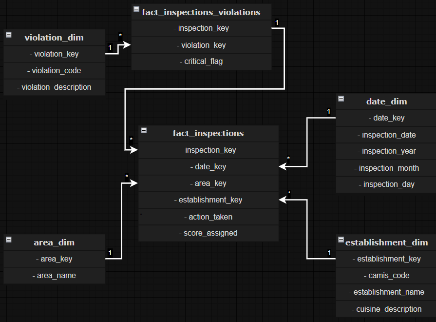

# Data Model – NYC Health Inspections

## Overview
This analytical data model is designed to support scalable, unbiased, and
reproducible analysis of NYC health inspections.

The model follows a **star schema–based design**, optimized for:
- aggregation performance
- explicit grain definition
- analytical SQL workflows
- BI tools such as Power BI

Special care has been taken to balance **data fidelity** and **analytical
stability**, given the limitations of the source dataset.

---

## Schema Type
**Star Schema (with a dependent bridge fact)**

The core of the model follows a classic star schema:
- conformed dimensions
- surrogate keys
- centralized fact tables
- no dimensional snowflaking

A secondary fact table is introduced to model inspection–violation relationships
without duplicating inspection-level measures.

This design preserves the benefits of a star schema while supporting
many-to-many relationships in a controlled and explicit way.

<figure style="text-align: center; margin: 1.5rem 0;">
  
  <figcaption style="margin-top: 0.5rem; font-style: italic;">
    Data model layout
  </figcaption>
</figure>

---

## Dimensions

### date_dim
**Grain:** one row per calendar date with at least one inspection

Attributes:
- inspection_date
- inspection_year
- inspection_month
- inspection_day

Purpose:
- time-based aggregation
- trend and seasonality analysis
- consistent temporal joins across fact tables

---

### area_dim
**Grain:** one row per geographic area

Attributes:
- area_name

Purpose:
- spatial comparison
- proportionality analysis between inspections and establishments

---

### establishment_dim
**Grain:** one row per establishment

Attributes:
- camis_code
- establishment_name
- cuisine_description

Purpose:
- establishment-level quality tracking
- inspection frequency analysis
- grouping and filtering by business characteristics

---

### violation_dim
**Grain:** one row per violation code

Attributes:
- violation_code
- violation_description

Purpose:
- classification of inspection violations
- support for critical vs non-critical analysis

---

## Fact Tables

### fact_inspection
**Grain:** one row per restaurant-day with at least one inspection

This table represents inspections approximated at restaurant-day level.
It is the **central fact table** of the star schema and holds inspection-level
measures.

Attributes:
- action_taken

Measures:
- score_assigned

Foreign Keys:
- date_key
- establishment_key
- area_key

Analytical Use:
- average inspection score
- inspection coverage by area
- temporal evolution of inspection outcomes
- establishment-level inspection analysis

---

### fact_inspection_violation
**Grain:** one row per (inspection, violation type)

This table models the relationship between inspections and violations.
It acts as a **dependent bridge fact table**, enabling violation-level analysis
without duplicating inspection measures.

Duplicate raw records are intentionally collapsed to ensure analytical clarity.

Attributes:
- critical_flag

Foreign Keys:
- inspection_key (link to `fact_inspection`)
- violation_key

Analytical Use:
- violation frequency analysis
- critical vs non-critical violations
- violation distribution by area and time (via `fact_inspection`)

---

## Relationships

### Dimension to Fact (Star Schema)
- date_dim → fact_inspection (1:N)
- establishment_dim → fact_inspection (1:N)
- area_dim → fact_inspection (1:N)

- violation_dim → fact_inspection_violation (1:N)

### Fact to Fact
- fact_inspection → fact_inspection_violation (1:N)

> `fact_inspection_violation` is **not a standalone star**.  
> All temporal, spatial, and establishment context must be accessed
> through `fact_inspection`.

---

## Design Decisions

- A star schema is used to simplify analytical queries and aggregations
- Inspections and violations are separated to avoid score duplication
- Violation data is normalized to inspection–violation level to avoid
  double counting caused by duplicated source records
- No derived metrics are stored in dimensions
- All KPIs are computed at query time
- Stable analytical grains are preferred over unreliable source identifiers

---

## Methodological Assumptions

### Inspection Grain Approximation
The source dataset does not provide a reliable inspection-level identifier.
For this reason, inspections are approximated at **restaurant-day level**.

All inspection records occurring on the same day for the same establishment
are deterministically collapsed into a single inspection record.

#### Impact Assessment
A validation stress test using `action_taken` as a proxy signal for multiple
inspections shows that only **~0.9% of restaurant-days** exhibit evidence
of multiple inspections.

The approximation is therefore considered acceptable for analytical purposes.

This approach guarantees:
- stable business-key uniqueness
- full dimensional coverage
- consistent joins across fact tables

---

### Inspection–Violation Relationship
Violations are modeled through a dedicated bridge fact table
(`fact_inspection_violation`) with grain **(inspection, violation type)**.

Duplicate raw records are intentionally collapsed in order to:
- avoid double counting
- support clean analytical aggregations
- preserve inspection-level measures

---

### Critical Flag Dependency
The `critical_flag` attribute is inspection-dependent but not strictly
inspection-level nor violation-level in the raw dataset.

Validation analysis shows that `critical_flag` is stable only at the
inspection–violation grain.

For this reason, `critical_flag` is stored in `fact_inspection_violation`
and not in a dimension table.

---

## Aggregation Rules

- Never join fact tables before aggregation
- Aggregate `fact_inspection` and `fact_inspection_violation` separately
- Join aggregated results only when required
- Counts from `fact_inspection_violation` represent counts of
  **inspection–violation pairs**, not raw violation events

---

## Model Limitations

- The model cannot distinguish multiple inspections occurring on the same
  restaurant-day
- The original ordering or timing of violations within an inspection
  is not preserved
- The model is optimized for analytical accuracy, not for operational auditing

---

## Model Strengths

- Clear and explicit grain definition at all levels
- Star schema structure with controlled complexity
- No double counting when facts are queried correctly
- Fully aligned with the physical DDL
- Easy to explain and defend in technical interviews
- Easily extensible with additional dimensions or facts

*Back to the [README](/README.md)*
