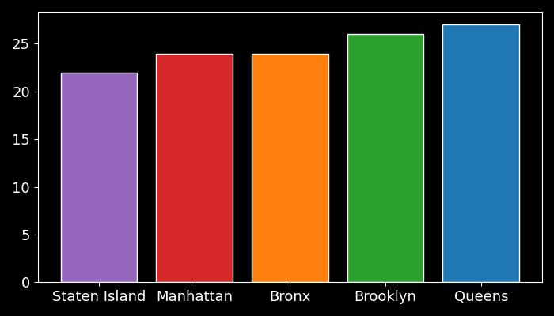

# Q1 – Data quality and inspection proportionality by area

## Analysis question

Health inspections in New York City are:

1. associated with **different average quality levels across areas**?
2. distributed **proportionally to the number of establishments** in each area?

This analysis therefore has a dual objective:

* to evaluate the **average hygienic-sanitary quality** by area
* to verify the **correctness and balance of the inspection system**

## Analytical context

The analysis uses the **star schema data model**, in particular:

* **Fact table**: `inspection_events_table`
* **Dimensions**:

  * `area_dim` (geographic location)
  * `establishment_dim` (establishments)

The main measure analyzed is:

* `score_assigned` (inspection score)

Recall that:

* a **higher score indicates a worse situation**
* a **lower score indicates better hygienic conditions**

# Q1a – Average inspection quality by area

## Objective

Compare New York City areas in terms of
**average inspection score**, in order to identify
potential structural differences in hygienic-sanitary quality.

## Analysis logic

1. Aggregate all inspection events by area
2. Compute the **average assigned score**
3. Sort the results to facilitate comparison

## SQL query

```sql
SELECT
    ad.area_name,
    ROUND(AVG(iet.score_assigned), 0) AS avg_score_assigned
FROM
    inspection_events_table AS iet
JOIN
    area_dim AS ad
    ON iet.area_key = ad.area_key
GROUP BY
    ad.area_name
ORDER BY
    avg_score_assigned ASC;
```

## Output

* CSV file: `avg_score_assigned_per_area.csv`

## Visualization

<p align="center">
  
</p>
<p align="center">
  <em>Average inspection score by area</em>
</p>

## Key results

* **Staten Island** shows the lowest average score
  → better hygienic-sanitary conditions on average
* **Queens** shows the highest average score
  → worse conditions on average compared to other areas
* Manhattan, Bronx, and Brooklyn fall in an intermediate range,
  with relatively similar values

## Insight (Q1a)

Differences between areas are not extreme,
but a **coherent geographic gradient** emerges:

* areas with higher urban and commercial density
  tend to have higher average scores
* less dense areas show better average results

This result alone is **not sufficient**
to assess the fairness of the inspection system:
it is therefore necessary to also verify **inspection proportionality**.

# Q1b – Inspection proportionality relative to establishments

## Objective

Verify whether the **number of inspections** carried out in each area
is proportional to the **number of establishments present**.

The initial hypothesis is that a fair inspection system
should show a similar ratio between:

* number of inspections
* number of establishments

## Analysis logic

1. Count the total number of establishments by area
2. Count the total number of inspections by area
3. Compute the ratio:

$$
\text{Inspections per establishment} =
\frac{\text{Total inspections per area}}
{\text{Number of establishments per area}}
$$

4. *see [Q1.sql](/04_queries/Q1/Q1.sql) for the complete query*

## Visualization

<p align="center">
  
</p>
<p align="center">
  <em>Average number of inspections per establishment (2015–2025)</em>
</p>

## Key results

* All areas cluster around **5–6 inspections per establishment**
* No area shows strongly anomalous values
* Observed differences are limited and coherent

## Insight (Q1b)

The number of inspections is **proportional to the number of establishments**
in all analyzed areas.

This indicates that:

* the inspection system is **structurally balanced**
* observed differences in average scores (Q1a)
  **are not due to inspection count bias**

## Q1 conclusion

Combining Q1a and Q1b leads to a key result:

* differences in average quality across areas
  **do not depend on different inspection intensity**
* the dataset shows **good quality and structural consistency**
* Q1 therefore also acts as a **data reliability check**
  before subsequent analyses

## Reference files

* SQL query: `Q1.sql`
* Aggregated data: `avg_score_assigned_per_area.csv`
* Visualization script: `Q1_chart.py`
* Chart output: `Q1.png`

*Back to the [queries list](/04_queries/queries.md)*
