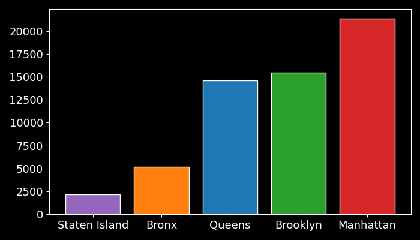

# Q2 – Criticità delle aree: eventi critici e incidenza relativa
## Domanda di analisi

Le diverse aree (Borough) di New York City presentano
**livelli differenti di criticità sanitaria**?

In particolare:
1. quali aree registrano il **maggior numero assoluto di eventi critici**?
2. tali differenze rimangono anche **normalizzando sul numero di ispezioni**?

L’obiettivo è distinguere tra:
- effetto **dimensionale** (più stabilimenti → più eventi)
- reale **maggiore incidenza di criticità**

## Contesto analitico

L’analisi utilizza il **modello dati a stella**, in particolare:

- **Fact table**: `inspection_events_table`
- **Dimensioni**:
  - `area_dim` (area geografica)
  - `inspection_dim` (violazioni, criticità, azioni)

Un evento è considerato **critico** se:
- `critical_flag = 'Critical'`
- **oppure** `action_taken` indica una chiusura dello stabilimento

# Q2a – Numero assoluto di eventi critici per area

## Obiettivo

Individuare le aree con il **maggior numero di ispezioni critiche**,
come prima misura grezza della pressione sanitaria.

## Logica dell’analisi

1. Si unisce la tabella dei fatti con:
   - dimensione geografica
   - dimensione ispezioni
2. Si filtrano solo gli eventi critici
3. Si conteggiano gli eventi per area


## Query SQL

```sql
SELECT
    ad.area_name,
    COUNT(iet.event_key) AS total_critical_events
FROM
    inspection_events_table AS iet
JOIN
    area_dim AS ad
    ON iet.area_key = ad.area_key
JOIN
    inspection_dim AS id
    ON iet.inspection_key = id.inspection_key
WHERE
    id.critical_flag = 'Critical'
    OR id.action_taken ILIKE '%Closed%'
GROUP BY
    ad.area_name
ORDER BY
    total_critical_events DESC;
```

## Output

<p align="center">
  
</p>
<p align="center">
  <em>Numero assoluto di eventi critici per area</em>
</p>

File CSV: `total_critical_events_per_area.csv`

## Risultati principali (Q2a)

- **Manhattan** registra il numero assoluto più elevato di eventi critici
- Seguono **Brooklyn** e **Queens**
- **Staten Island** presenta il numero più basso

Questa distribuzione è coerente con:

- numero di stabilimenti
- volume complessivo di ispezioni

## Limite dell’analisi assoluta

Il conteggio assoluto **non è sufficiente** per confrontare le aree,
poiché non tiene conto di:

- diverso numero di ispezioni
- diversa densità commerciale

È quindi necessario un confronto **normalizzato**.

# Q2b – Incidenza degli eventi critici (normalizzazione)

## Obiettivo

Verificare se alcune aree presentano una **percentuale più elevata di eventi critici** rispetto al totale delle ispezioni effettuate.

## Logica dell’analisi

Per ciascuna area si calcola:

$$
\text{Incidenza eventi critici} =
\frac{\text{Ispezioni critiche per area}}
{\text{Ispezioni totali per area}}
$$

Il numero totale di ispezioni per area è stato ricavato in **Q1**.

## Risultati normalizzati

| Area          | % eventi critici | Ispezioni critiche | Ispezioni totali |
|:-:|:-:|:-:|:-:|
| Manhattan     |            55.8% |             21 331 |           38 272 |
| Brooklyn      |            56.3% |             15 477 |           27 478 |
| Queens        |            56.8% |             14 624 |           25 756 |
| Bronx         |        **55.2%** |              5 157 |            9 341 |
| Staten Island |        **57.2%** |              2 151 |            3 764 |


## Insight (Q2b)

Una volta normalizzati i dati:

* le differenze tra le aree **si riducono drasticamente**
* tutte le aree mostrano un’incidenza di eventi critici
  compresa tra **55% e 57%**
* **non emergono outlier significativi**


## Conclusione di Q2

Combinando Q2a e Q2b emerge che:

* le differenze assolute dipendono principalmente
  da **dimensione e volume di ispezioni**
* il **livello di criticità relativa** è sorprendentemente uniforme
  tra le diverse aree

Q2 rafforza quindi quanto emerso in **Q1**:
le differenze osservate nei risultati **non sono dovute**
a un trattamento diseguale delle aree.

## File di riferimento

* Query SQL: `Q2.sql`
* Dati aggregati: `total_critical_events_per_area.csv`
* Script di visualizzazione: `Q2_chart.py`
* Output grafico: `Q2.png`

*Torna alla [lista di queries](/04_queries/queries.it.md)*