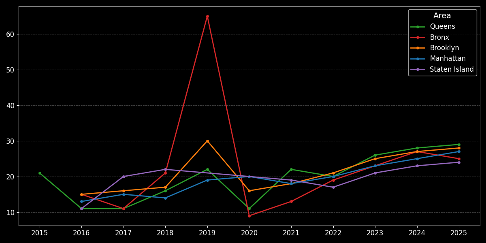
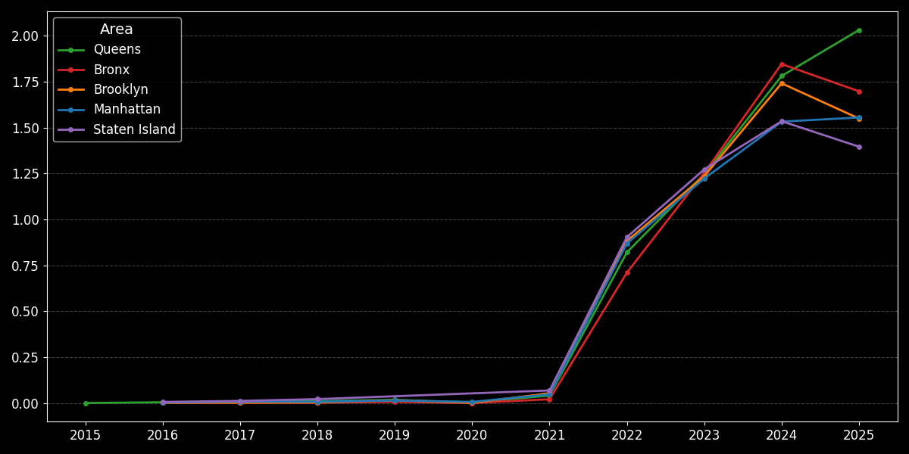
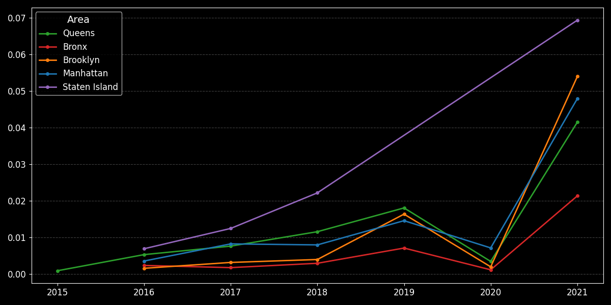

# Q3 – Temporal Trend Analysis by Area

## Analysis Questions

How have the following evolved over time, for each area of New York City:

1. the **average inspection score**
2. the **number of inspections performed**, normalized by the number of establishments
3. the behavior of inspections in the early period of the dataset (2015–2021)

The objective is to identify:
- trends of improvement or deterioration in sanitary quality
- structural changes in inspection intensity
- long-term differences between areas

---

## Analytical Context

The analysis uses a **star schema**:

- **Fact table**: `inspection_events_table`
- **Dimensions**:
  - `date_dim` (time)
  - `area_dim` (geographic area)
  - `establishment_dim` (establishments, for normalization)

The main metric analyzed is:
- `score_assigned` (inspection score)

---

## Analysis Structure

Q3 is divided into three complementary sub-analyses:

- **Q3a** – Trend of average score by area and year  
- **Q3b** – Trend of the number of inspections *normalized* by the number of establishments  
- **Q3c** – Temporal zoom on the Q3b trend for the 2015–2021 period  

This breakdown makes it possible to distinguish between:
- variations driven by **quality**
- variations driven by **inspection intensity**
- effects related to the **temporal coverage of the dataset**

---

# Q3a – Trend of Average Inspection Score by Area

## Analysis Logic

1. Inspections are aggregated by:
   - year
   - area
2. The **average score** is calculated
3. The temporal evolution is observed for each area

```sql
SELECT
    dd.inspection_year,
    ad.area_name,
    ROUND(AVG(iet.score_assigned), 0) AS avg_score
FROM
    inspection_events_table AS iet
JOIN
    date_dim AS dd ON iet.date_key = dd.date_key
JOIN
    area_dim AS ad ON iet.area_key = ad.area_key
GROUP BY
    dd.inspection_year,
    ad.area_name
ORDER BY
    dd.inspection_year,
    ad.area_name;
````

---

## Visualization

<p align="center">
  
</p>
<p align="center">
  <em>Evolution of the annual average inspection score by area</em>
</p>

---

## Key Results

* All areas show a **peak in 2019**
* In **2020**, a generalized drop is observed
* From **2021 onward**, a stable upward trend emerges
* The **Bronx** shows the most pronounced variation in the 2019–2021 period

---

## Insight (Q3a)

The anomalous behavior in the 2019–2020 period suggests
an **exogenous effect** on the inspection system,
which is analyzed in more detail in the following sections.

---

# Q3b – Trend of the Number of Inspections Normalized per Establishment

## Rationale for Normalization

The areas of New York City differ significantly in terms of:

* number of establishments
* commercial density

For a fair comparison, the number of inspections is
**normalized by the number of establishments per area**.

---

## Analysis Logic

1. Inspections are counted by area and year
2. The count is divided by the total number of establishments in the area
3. A measure of **inspection intensity** is obtained

---

## Visualization

<p align="center">
  
</p>
<p align="center">
  <em>Number of inspections per establishment (annual trend)</em>
</p>

---

## Key Results

* In the **pre-2020** period, inspection intensity is similar across areas
* In **2020**, a sharp drop is observed in all areas
* From **2021**, inspections per establishment increase rapidly
* **Staten Island** shows the strongest growth in the post-2020 period

---

## Insight (Q3b)

The variation in average scores observed in Q3a
is strongly influenced by changes in **inspection intensity**.

---

# Q3c – Temporal Zoom on the 2015–2021 Period

## Objective

Analyze in greater detail the early period of the dataset
(2015–2021), characterized by:

* lower data volume
* a strong discontinuity in 2020

This analysis represents a **zoomed view of the Q3b chart**.

---

## Visualization

<p align="center">
  
</p>
<p align="center">
  <em>Focus on the number of inspections per establishment (2015–2021)</em>
</p>

---

## Key Results

* Data prior to 2021 are less stable and less complete
* The **2019 peak** and the **2020 collapse** are even more evident
* The recovery from 2021 marks a structural shift in the inspection system

---

## Insight (Q3c)

The scarcity and discontinuity of data in the early period suggest that:

* some pre-2021 rows may have been excluded
  during the cleaning phase (missing dates or scores)
* the most robust and reliable analyses
  focus on **2021 onward**

---

## Q3 Conclusions

Combining Q3a, Q3b, and Q3c shows that:

* the average score is **strongly influenced** by inspection intensity
* **2020 represents a structural discontinuity** in the dataset
* from **2021**, the inspection system appears more homogeneous across areas

---

## Reference Files

* SQL query: `Q3.sql`
* Visualization script: `Q3.py`
* Score data: `score_history.csv`
* Inspection data: `inspection_count_history.csv`
* Chart outputs:

  * `Q3_a.png`
  * `Q3_b.png`
  * `Q3_c.png`

*Back to the [queries list](/04_queries/queries.md)*
