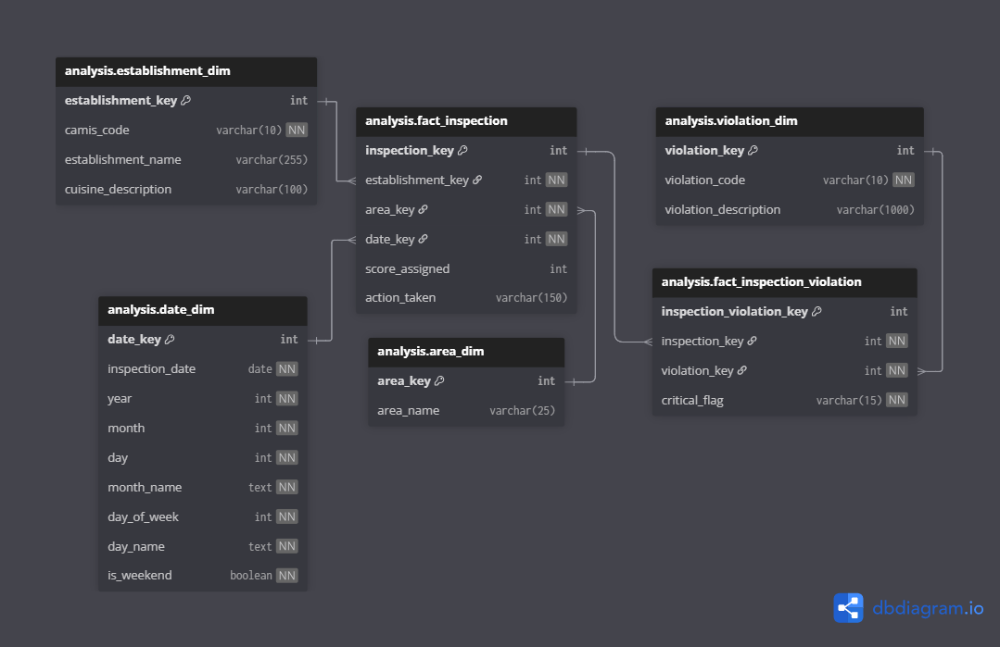

# Project Overview — NYC Restaurant Inspections Analytics

## 1. Project intent and scope

This project implements an **end-to-end analytical workflow** based on disciplined data modeling principles applied to NYC restaurant inspection data.

The objective is to demonstrate:

* semantic clarity
* reproducibility
* deterministic KPI design
* explicit handling of source-imposed constraints

The project prioritizes **model robustness, interpretability, and traceability** over automation, predictive modeling, or domain-specific optimization.

---

## 2. Data source and domain constraints

**Source**
NYC Department of Health and Mental Hygiene (DOHMH) — Restaurant Inspection Results (public dataset).

**Domain characteristics**

* Inspection events with associated sanitary violations
* Multiple violations per inspection
* No stable inspection identifier

These constraints directly shape:

* analytical grain definition
* fact table structure
* KPI design and interpretability

They are treated as **first-class modeling constraints**, not data quality defects.

---

## 3. Analytical questions addressed

The analysis supports operational evaluation through **consistent and comparable KPIs** focused on:

* inspection outcomes and geographic variation
* concentration of high-risk inspections
* severity drivers and distributional behavior
* relationship between inspection severity and enforcement actions
* temporal evolution of inspection outcomes

Metrics are framed around **frequency, intensity, severity, and time**, not ad-hoc reporting.

---

## 4. End-to-end analytical architecture

The project follows a **layered analytical architecture** designed for traceability and control.

### Workflow overview

1. Raw data ingestion and preservation
2. Deterministic transformation into an analytical star schema
3. Exposure of stable KPI views for consumption and documentation

Each stage exposes a clear contract to the next, enabling full lineage from KPIs back to source data.

---

## 5. Layer separation and responsibilities

Responsibilities are explicitly separated across three layers.

### STAGING layer

* Raw data landing zone
* Preserves source structure and semantics
* Minimal technical standardization
* No analytical logic

### ANALYSIS layer

* Authoritative dimensional model
* Explicit grain enforcement
* Deterministic semantic rules
* Validated fact tables and dimensions

### MART layer

* Read-only KPI views
* Stable analytical outputs
* No modeling or semantic reinterpretation

This separation minimizes coupling between ingestion, modeling, and reporting logic.

---

## 6. Analytical data model

### Star schema design

The analytical model follows a **star schema** optimized for inspection analysis.

* Central inspection fact table
* Dedicated inspection–violation bridge table
* Conformed dimensions for time, geography, establishments, and violations

Explicit grain declaration and stable join paths prevent ambiguous aggregation.

  

---

## 7. Fact grain and dimensional roles

**Inspection grain**
One restaurant on one inspection date, reconstructed deterministically due to lack of a stable inspection identifier.

**Violation grain**
Preserved via a dedicated bridge table to retain full violation-level detail without duplicating inspection facts.

Dimensions provide consistent slicing across:

* time
* location
* establishments
* violation types

---

## 8. KPI design framework

### KPI philosophy

KPIs are designed as **explicit semantic contracts**.

* One KPI = one stable SQL view
* Deterministic definitions
* Reusable across consumption contexts

Frequency, intensity, severity, and tail-risk metrics are **complementary**, not interchangeable.

---

### Valid populations and filters

Each KPI defines and enforces its **reference population** at the view level.

* Inclusion and exclusion rules are documented once
* No hidden filters
* Metrics computed on different populations are **not implicitly comparable**

---

### Temporal analysis

* Annual time grain derived from the date dimension
* Explicit ordering rules
* Rolling averages applied at the KPI layer to reduce volatility

All temporal interpretation is bounded by observed coverage only.

---

### Thresholds and statistical stability

Minimum volume thresholds act as **analytical safeguards**.

* Improve ranking stability
* Constrain interpretation
* Do not alter or correct source data

---

## 9. Reproducibility and implementation principles

* All transformations and KPIs defined in SQL
* Identical inputs produce identical outputs
* No procedural logic or BI-specific behavior embedded

SQL represents the **single source of truth**.
Documentation describes semantics and constraints without redefining logic.

---

## 10. Documentation strategy

The repository includes dedicated markdown documentation for:

* each analytical layer
* KPI definitions and interpretation

Documentation supports both:

* technical review
* high-level analytical assessment

The goal is rapid evaluation of model soundness and metric reliability.

---

## 11. Repository structure

The repository is organized by analytical layer:

* staging data
* analytical models
* KPI views
* documentation

This mirrors the pipeline architecture and supports clarity, maintenance, and reuse.

---

## 12. Execution requirements

* Relational database with standard SQL support
* Common table expressions
* Window functions

No proprietary extensions or external dependencies are required.

---

## 13. Known analytical limitations

The model reflects source-imposed constraints:

* inspection identifiers reconstructed at restaurant–day level
* some inspection attributes vary within the same inspection proxy
* uneven historical coverage in early years

These limitations bound interpretation but do not compromise analytical consistency.

---

## 14. Out-of-scope and extensions

**Explicitly out of scope**

* predictive modeling
* causal inference
* real-time monitoring

**Potential extensions**

* additional dimensions
* alternative aggregations
* external contextual data

All extensions would require explicit documentation of new grains and assumptions.

# Notes

Data source: [NYC Department of Health and Mental Hygiene (DOHMH) - Restaurant Inspection Results](https://catalog.data.gov/dataset/dohmh-new-york-city-restaurant-inspection-results). The dataset is published as open government data via data.gov and can be freely redistributed.

